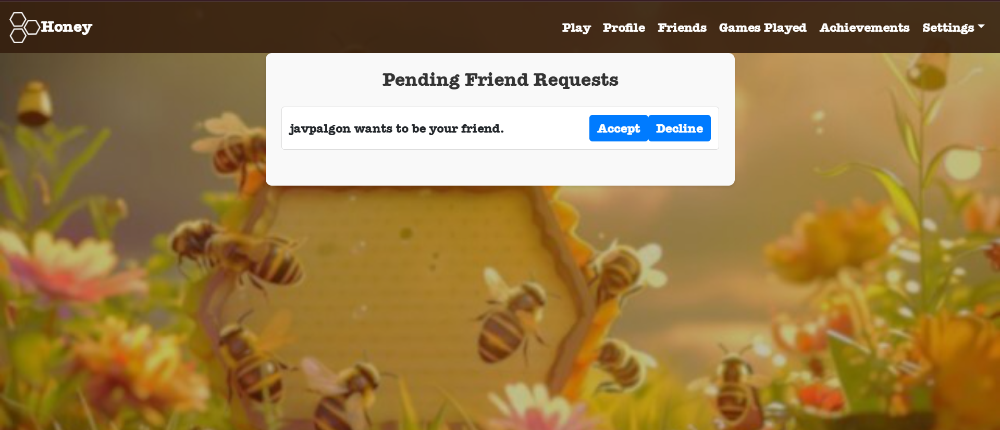

# Documento de Requisitos y Análisis del Sistema

**Diseño y Pruebas I - L1.03**

**Proyecto: Honey**

Repositorio: [https://github.com/gii-is-DP1/DP1-2024-2025--l1-03](https://github.com/gii-is-DP1/DP1-2024-2025--l1-03)  
Enlace video: [YouTube](https://www.youtube.com/watch?v=0auTOvJf2NI&t=24s)

## Introducción:

Honey es un juego de estrategia apto para todas las edades y para jugar en cualquier momento del día. Vamos a desarrollar su versión online con el objetivo de ofrecer una experiencia accesible y entretenida para todo tipo de jugadores.

Es un juego en el que pueden participar de 1 a 4 personas. El juego incluye:
- 1 tablero principal en forma de panal de abeja formado por 19 hexágonos.
- 72 piezas de miel.

### Modos de juego:

#### Modo solitario (Solo Mode):
Un único jugador vacía el tablero de fichas de miel formando grupos de al menos 3 fichas del mismo color para ganar puntos.

#### Modo multijugador (Multiplayer Mode):
De 2 a 4 jugadores compiten por acumular la mayor cantidad de puntos formando coincidencias de fichas.

#### Modo superviviente (Survival Mode):
Un jugador forma grupos de al menos tres fichas del mismo color para vaciar progresivamente las fichas del tablero.

## Tipos de Usuarios / Roles:

### Jugador:
El objetivo principal del jugador es obtener la mayor puntuación creando secuencias de 3 fichas del mismo color.

### Administrador:
El administrador tiene acceso a funcionalidades adicionales que los jugadores no tienen.

## Historias de Usuario:

### Como jugador:

**H1 Login:** Iniciar sesión usando usuario y contraseña.

#### Escenarios positivos:
  - ***H1+1 Inicio de sesión exitoso:*** El usuario previamente registrado rellena los campos con sus credenciales y accede con éxito.

#### Escenarios negativos:
  - ***H1-1 Credenciales incorrectas:*** El jugador intenta iniciar sesión pero ingresa incorrectamente su correo electrónico o contraseña. La aplicación muestra un mensaje de error que indica que las credenciales son incorrectas. El jugador debe volver a ingresar las credenciales correctamente para acceder.

**H2 Sign-up:** Registrar una cuenta nueva con usuario, contraseña y foto de perfil.

#### Escenarios positivos:
  - ***H2+1 Registro exitoso:*** El usuario escribe “javpa22” en username, javpa2004@mail.com” en email y javi123 en password y se crea su perfil.

#### Escenarios negativos:
  - ***H2-1 Nombre de usuario repetido:*** El usuario intenta registrarse con el nombre de usuario “javiliyo” pero ya hay un usuario con ese username por lo que da error: “Nombre de usuario ya existe”.
  - ***H2-2 Correo electrónico repetido:*** El usuario intenta registrarse con la dirección de correo electrónico “jav@mail.com” que ya está asociada a otro usuario en el juego y salta un error: “La dirección de correo electrónico ya está vinculada a una cuenta”.
  - ***H2-3 Nombre de usuario repetido:*** El usuario intenta registrarse con el nombre de usuario “javiliyo” pero ya hay un usuario con ese username por lo que da error: “Nombre de usuario ya existe”.
  
**H3 Logout:** Cerrar sesión para evitar que otros usen tu cuenta.

#### Escenarios positivos:
  - ***H3+1 Log Out exitoso:*** El usuario accede a perfil, hace logout y cierra la sesión con éxito.

#### Escenarios negativos:
  - ***H3-1 Log Out fracasado:*** El usuario accede a perfil, hace logout pero la sesión no se cierra y la cuenta sigue logueada.

**H4 Elección de modalidad:** Seleccionar entre solitario, multijugador o supervivencia.

#### Escenarios positivos:
  - ***H4+1 Elección de modalidad exitosa:*** El usuario elige el modo de partida y se crea la partida de ese modo elegido.

#### Escenarios negativos:
  - ***H4-1 Elección de modalidad fracasado:*** El usuario elige el modo de partida y no se crea la partida del modo elegido. 

**H5 Fichas en mano:** Ver ambas caras de las fichas disponibles.

#### Escenarios positivos:
  - ***H5+1 Observación exitosa de las fichas:*** El usuario ve en sus fichas el color del 
fondo de ellas.

#### Escenarios negativos:
  - ***H5-1 Incapacidad de observación de las fichas:*** El usuario en sus fichas no le sale el color de fondo.
  - ***H5-2 Errónea observación de las fichas:*** El usuario ve un color de fondo en sus fichas que no es el mismo que tienen al darle la vuelta.

**H6 Movimientos posibles:** Colocar fichas en el tablero o coger una de la bolsa.

#### Escenarios positivos:
  - ***H6+1 Elegir colocar fichas con éxito:*** El usuario elige colocar fichas en su turno y puede colocar la ficha.
  - ***H6+2 Elegir coger una ficha de la bolsa:*** El usuario elige coger una ficha de la bolsa en su turno y puede coger la ficha de la bolsa.

#### Escenarios negativos:
  - ***H6-1 Elegir colocar ficha sin éxito:*** El usuario elige colocar fichas en su turno y no puede colocar la ficha.
  - ***H6-2 Elegir coger una ficha de la bolsa sin éxito:*** El usuario elige coger una ficha de la bolsa en su turno y no puede coger la ficha de la bolsa.

**H7 Control de turnos:** Ver a quién pertenece el turno.

#### Escenarios positivos:
  - ***H7+1 Turno actual:*** El jugador abre la interfaz del juego y puede ver claramente a quién le pertenece el turno mediante un indicador visible (por ejemplo, el nombre o avatar del jugador destacado).
  - ***H7+2 Cambio del turno:*** Cuando es el turno del jugador, el indicador cambia hacia él, notificándole que es su momento de participar.

#### Escenarios negativos:
  - ***H7-1 Turno no es claro:*** La interfaz del juego no indica claramente a quién le pertenece el turno, o el indicador es confuso (por ejemplo, el indicador es demasiado pequeño, no se actualiza en tiempo real, o se mezcla visualmente con el resto de la interfaz).

**H8 Combinación de fichas:** Hacer combinaciones de 3 o más fichas en el tablero.

#### Escenarios positivos:
  - ***H8+1 Colocar fichas con éxito:*** El jugador coloca las fichas correctamente en el tablero, cumpliendo con las reglas del juego, y logra formar una combinación válida que le otorga puntos.

#### Escenarios negativos:
  - ***H8-1 Colocar ficha sin éxito:*** El jugador coloca fichas que no forman una combinación válida y no recibe puntos. 

**H9 Acabar turno:** Terminar el turno después de colocar fichas.

#### Escenarios positivos:
  - ***H9+1 Finalización exitosa del turno:*** El jugador puede finalizar su turno de manera clara y sencilla al hacer clic en un botón o realizar una acción específica.
  - ***H9+2 Cambio de turno exitoso:*** El juego cambia de turno correctamente, pasando al siguiente jugador sin errores ni demoras.

#### Escenarios negativos:
  - ***H9-1 Finalización sin éxito del turno:*** El jugador intenta finalizar su turno pero el sistema no responde correctamente, impidiendo el paso al siguiente jugador.
  - ***H9-2 Cambio de turno fracasado:*** El turno se cambia automáticamente sin que un jugador lo haya solicitado.

**H10 Control de puntuación:** Ver la puntuación de cada jugador.

#### Escenarios positivos:
  - ***H10+1 Información clara y accesible:*** Durante una partida multijugador, el jugador puede ver las puntuaciones de todos los participantes al final de cada turno en un panel en la pantalla.
  - ***H10+2 Puntuación inmediata:*** En el modo solitario, al finalizar cada turno, el jugador recibe una notificación inmediata de su puntuación acumulada.
  - ***H10+3 Puntuación visible:*** En el modo supervivencia, el jugador puede ver su puntuación en todo momento mientras avanza, lo que lo motiva a seguir jugando.

#### Escenarios negativos:
  - ***H10-1 Puntuación confusa o inexacta:*** Durante una partida multijugador, el sistema no actualiza la puntuación correctamente al finalizar los turnos, generando confusión entre los jugadores.
  - ***H10-2 Falta de información:*** En el modo solitario, al finalizar un turno, no se muestra la puntuación inmediatamente o es difícil de encontrar, lo que desmotiva al jugador.
  - ***H10-3 Puntuación invisible o errónea:*** En el modo supervivencia, la puntuación del jugador no es visible o no es acorde a la realidad mientras juega, lo que impide que pueda hacer un seguimiento de su rendimiento.
    
**H11 Resultado final:** Ver el ranking de los jugadores al final de la partida.

#### Escenarios positivos:
  - ***H11+1 Visualización Correcta del Ranking Final:*** El jugador puede ver claramente las puntuaciones de todos los participantes y determinar al ganador de la partida. No hay retrasos ni errores en la visualización del ranking.

#### Escenarios negativos:
  - ***H11-1 Error en la Generación del Ranking Final:*** El jugador no puede conocer quién es el ganador, y las puntuaciones no se muestran correctamente, afectando la experiencia de juego.

**H12 Listado de partidas:** Ver partidas creadas y en las que participas.

#### Escenarios positivos:
  - ***H12+1 Visualización exitosa de partidas:*** Dado que el jugador ha iniciado sesión correctamente,cuando accede al apartado de "Mis partidas",entonces se le muestra una lista completa y actualizada de todas las partidas que ha creado o en las que participa,y puede ver información detallada como el nombre de la partida, el estado (activa, en curso, finalizada), los participantes y la fecha de creación.

#### Escenarios negativos:
  - ***H12-1 Fallo al cargar partidas:*** Ocurre un error en la conexión con el servidor o la base de datos,entonces no se carga la lista de partidas, y se muestra un mensaje de error indicando que no se pudieron recuperar las partidas en este momento, sugiriendo al jugador que intente nuevamente más tarde.

**H13 Edición del perfil:** Editar el perfil actual.

#### Escenarios positivos:
  - ***H13+1 Editar el nombre del usuario de forma exitosa:*** El jugador puede editar su nickname, los cambios se guardan correctamente y se reflejan inmediatamente en el perfil del jugador.
  - ***H13+2 Editar la foto de perfil de forma exitosa:*** El jugador puede editar su foto de perfil, los cambios se guardan correctamente y se reflejan inmediatamente en el perfil del jugador.

#### Escenarios negativos:
  - ***H13-1 Editar el nickname sin éxito:*** El jugador intenta editar su nickname, pero los cambios no se guardan correctamente y no se reflejan en el perfil del jugador.
  - ***H13-2 Editar la foto de perfil sin éxito:*** El jugador intenta editar su foto de perfil, pero los cambios no se guardan correctamente y no se reflejan en el perfil del jugador.

**H14 Estadísticas:** Ver estadísticas de partidas jugadas, victorias y puntos.

#### Escenarios positivos:
  - ***H14+1 Perfil con estadísticas claras y detalladas:*** El jugador accede a su perfil y puede visualizar un historial completo de todas sus partidas jugadas, victorias y puntos acumulados.

#### Escenarios negativos:
  - ***H14-1 Falta de actualización en las estadísticas:*** El jugador accede a su perfil y ve que las partidas jugadas o los puntos no se actualizan correctamente.

**H15 Ajustes:** Modificar ajustes generales del juego.

**H16 Amigos:** Añadir amigos por su nombre de usuario.

#### Escenarios positivos:
  - ***H16+1 Agregar amigo correctamente:*** Poner el nombre de un jugador y agregarlo con éxito.

#### Escenarios negativos:
  - ***H16-1 Usuario no encontrado:*** El jugador pone un nombre de otro que no existe.
    
**H17 Lista de amigos:** Ver la lista de amigos agregados.

#### Escenarios positivos:
  - ***H17+1 Ver la lista de amigos con éxito:*** El jugador puede acceder a su lista de amigos agregados y ver correctamente los perfiles de cada uno.
  - ***H17+2: Eliminar un amigo con éxito:*** El jugador decide eliminar a uno de sus amigos de la lista y es eliminado correctamente de la lista.

#### Escenarios negativos:
  - ***H17-1 Ver la lista de amigos sin éxito:*** El jugador no puede acceder a su lista de amigos agregados y ver los perfiles de cada uno.
  - ***H17-2: Eliminar un amigo sin éxito:*** El jugador no puede eliminar a uno de sus amigos de la lista.

**H18 Reglas:** Leer las reglas de los tres modos de juego.

**H19 Finalizar partida:** Terminar la partida en modo solitario o supervivencia.

#### Escenarios positivos:
  - ***H19+1 Finalizar partida correctamente:*** El jugador decide finalizar la partida y el juego se cierra correctamente mostrando los resultados finales.

#### Escenarios negativos:
  - ***H19-1 Error al finalizar partida:*** El jugador intenta finalizar la partida, pero el juego no responde y no se cierra correctamente.

**H20 Recibir consejos durante el transcurso de la partida:** Recibir consejos para conocer de manera rápida cómo jugar.

#### Escenarios positivos:
  - ***H20+1 Consejos mostrados correctamente:*** Durante la partida, el jugador recibe consejos útiles que le ayudan a entender cómo jugar sin interrupciones.

#### Escenarios negativos:
  - ***H20-1 Consejos no aparecen:*** El jugador no recibe consejos durante la partida, lo que dificulta entender las mecánicas del juego.

### Como administrador:

**H21 Listado de partidas en curso:** Ver partidas en curso y sus participantes.

#### Escenarios positivos:
  - ***H21+1 Listado de partidas mostrado correctamente:*** El administrador solicita el listado de partidas en curso y el sistema le muestra de forma clara el usuario creador, los participantes, y el estado de ejecución de cada partida.

#### Escenarios negativos:
  - ***H21-1 Error al cargar el listado de partidas:*** El administrador intenta obtener el listado de partidas en curso, pero el sistema arroja un error, impidiendo visualizar la información de los usuarios y participantes.

**H22 Listado de partidas jugadas:** Ver el historial de partidas jugadas.

**H23 Listado de usuarios registrados:** Ver un listado paginado de usuarios registrados.

#### Escenarios positivos:
  - ***H23+1 Listado de usuarios mostrado correctamente:*** El administrador solicita el listado de usuarios y el sistema le muestra de forma clara todos los usuarios existentes.

#### Escenarios negativos:
  - ***H23-1 Error al cargar el listado de usuarios:*** El administrador intenta obtener el listado de los usuarios, pero el sistema arroja un error.

**H24 Operaciones CRUD sobre los usuarios:** Crear, ver, editar y eliminar usuarios.

**H25 Amigos Online:** Visualizar el listado de amigos online.

#### Escenarios positivos:
  - ***H25+1 Listado de amigos mostrado correctamente:*** El jugador solicita ver la lista de amigos online y el sistema muestra de forma clara y precisa los amigos que están conectados en ese momento.

#### Escenarios negativos:
  - ***H25-1 Error al cargar el listado de amigos:*** El jugador intenta acceder a la lista de amigos online, pero el sistema arroja un error o no carga la información correctamente.

**H26 Ranking global:** El jugador puede ver el ranking global, donde se muestra de forma ordenada a los mejores jugadores según sus puntuaciones o logros.

#### Escenarios positivos:
  - ***H26+1 Ranking global mostrado correctamente:*** El jugador solicita ver el ranking global, y el sistema presenta la información de manera clara, ordenada y completa, incluyendo las posiciones de los jugadores y sus puntuaciones.

#### Escenarios negativos:
  - ***H26-1 Error al cargar el ranking global:*** El jugador intenta acceder al ranking global, pero el sistema arroja un error o no carga la información, mostrando un mensaje de fallo o dejando la pantalla en blanco.

**H27 Solicitudes pendientes de amistad:** El jugador puede ver las solicitudes de amistad que están pendientes, permitiendo gestionar las mismas (aceptar o rechazar).

#### Escenarios positivos:
  - ***H27+1 Solicitudes pendientes mostradas correctamente:*** El jugador solicita ver las solicitudes de amistad pendientes, y el sistema presenta la información de manera clara y ordenada, mostrando los nombres y detalles relevantes de los jugadores que enviaron las solicitudes.

#### Escenarios negativos:
  - ***H27-1 Error al cargar las solicitudes pendientes:*** El jugador intenta acceder a las solicitudes de amistad pendientes, pero el sistema arroja un error o no carga la información, mostrando un mensaje de fallo o dejando la pantalla vacía.

**H28 Crear partida multiplayer:** Un jugador puede crear una partida multijugador y obtener un código único que puede compartir con otros jugadores para que se unan. Una vez creada, el creador es llevado a un lobby (sala de espera) donde puede ver la lista de jugadores que se van uniendo. Desde el lobby, el creador tiene la opción de pulsar "Start Game" para iniciar la partida cuando esté listo.

#### Escenarios positivos:
  - ***H28+1 Partida multiplayer creada y lobby mostrado correctamente:*** El jugador crea una partida multijugador, el sistema genera un código único y lo lleva al lobby. En el lobby, se muestran de manera clara y actualizada los jugadores que se van uniendo, y el creador puede iniciar la partida pulsando "Start Game" sin ningún problema.

#### Escenarios negativos:
  - ***H28-1 Error al crear la partida o mostrar el lobby:*** El jugador intenta crear una partida multijugador, pero el sistema arroja un error, ya sea al generar el código único o al acceder al lobby. Esto impide al creador visualizar a los jugadores o utilizar la opción de "Start Game."
 - ***H28-2 Error al pulsar "Start Game":*** Desde el lobby, el creador intenta iniciar la partida pulsando "Start Game," pero el sistema arroja un error, dejando al creador y a los jugadores en el lobby sin que la partida comience.

**H29 Unirse a una partida multiplayer:** Un jugador puede unirse a una partida multijugador utilizando un código único proporcionado por el creador de la partida.

#### Escenarios positivos:
  - ***H29+1 Unión exitosa al lobby de la partida multiplayer:*** El jugador ingresa el código único proporcionado por el creador de la partida y el sistema lo conecta correctamente, mostrando los detalles de la partida y permitiendo su participación.

#### Escenarios negativos:
  - ***H29-1 Error al ingresar al lobby de la partida multiplayer:*** El jugador ingresa el código único, pero el sistema arroja un error. Esto puede deberse a un código inválido, la partida ya no está disponible, o un problema técnico impide que el jugador acceda al lobby.

**H30 Achievements (Player):** Un jugador puede ver una lista de logros y reclamar los logros desbloqueados.

#### Escenarios positivos:
  - ***H30+1 Visualización exitosa de los logros existentes y desbloqueados:*** El jugador accede correctamente a la lista de logros y puede ver los logros existentes y los que ha desbloqueado, con la opción de reclamarlos.

#### Escenarios negativos:
  - ***H30-1 Error al acceder a la lista de logros:*** El jugador intenta acceder a la lista de logros, pero el sistema arroja un error. Esto puede deberse a un problema técnico o a que no se han desbloqueado logros en la cuenta del jugador.

**H31 Operaciones CRUD sobre los achievements (Admin):** Crear, ver, editar y eliminar achievements.

#### Escenarios positivos:
  - ***H31+1 Visualización,creación,eleminación y edición exitosa de los logros existentes.***
#### Escenarios negativos:
  - ***H31-1 Error al visualizar,crear,editar o eleminar a un logro.***

**H32 Eliminar amigos y ver el perfil:** El jugador puede eliminara a un amigo y ver su perfil.

#### Escenarios positivos:
  - ***H32+1 Amigo eliminado correctamente:*** El jugador selecciona un amigo para eliminarlo de su lista de amigos. El sistema procesa la solicitud correctamente y actualiza la lista.
  - ***H32+2 Perfil de amigo visto correctamente:*** El jugador selecciona un amigo para ver de su lista de amigos. El sistema procesa la solicitud correctamente y le dirige a una nueva pantalla con su perfil.

#### Escenarios negativos:
  - ***H32-1 Error al intentar eliminar un amigo:*** El jugador intenta eliminar a un amigo, pero el sistema falla al procesar la solicitud, mostrando un mensaje de error o dejando la lista de amigos sin cambios.
  - ***H32-2 Error al intentar ver el perfil un amigo:*** El jugador intenta ver el perfil de un amigo, pero el sistema falla al procesar la solicitud, y no le redirige a la nueva pantalla.

## Diagrama conceptual del sistema:

## Reglas de Negocio:

- **RdN 1 - Partida única:** Un jugador no puede jugar más de una partida al mismo tiempo.
- **RdN 2 - Jugar multijugador:** Para jugar multijugador, las personas deben estar agregadas como amigos.
- **RdN 3 - Número de jugadores:** El modo multijugador requiere un mínimo de 2 y un máximo de 4 jugadores.
- **RdN 4 - Puntuación inicial:** Todos los jugadores comienzan con 0 puntos.
- **RdN 5 - Colocación de fichas:** Las fichas deben colocarse con su lado vacío hacia arriba.
- **RdN 6 - Combinaciones:** Las fichas deben pertenecer a una misma combinación.
- **RdN 7 - Dar la vuelta a las fichas:** Las fichas participantes en una combinación se voltean.

### Modo Solitario:

- **RdN 8 - Comienzo partida:** Colocar fichas en las esquinas del tablero.
- **RdN 9 - Tamaño de la mano:** El tamaño de la mano es igual a la puntuación.
- **RdN 10 - Ver fichas:** El jugador puede ver ambos lados de las fichas.
- **RdN 11 - Puntuación:** Lograr combinaciones de 3 fichas otorga puntos.
- **RdN 12 - Puntos extra:** Las combinaciones con más de 3 fichas otorgan puntos adicionales.
- **RdN 13 - Fin de partida:** El juego termina cuando se vacía el tablero o la bolsa.

### Modo Supervivencia:

- **RdN 15 - Ver fichas:** El jugador no puede ver el lado lleno de las fichas hasta voltearlas.
- **RdN 16 - Excepción de puntos:** Los clusters de 3 fichas no puntúan.
- **RdN 17 - Eliminación de fichas de esquinas:** Las fichas de las esquinas se eliminan con dos combinaciones.
- **RdN 18 - Fin de partida:** La partida termina si se eliminan las fichas de las esquinas o el tablero está lleno.

### Modo Multijugador:

- **RdN 20 - Acción única:** Solo se puede realizar una acción por turno.
- **RdN 21 - Turno de juego:** Solo se pueden realizar acciones en el turno propio.
- **RdN 22 - Comienzo de partida:** El tablero empieza vacío, y los jugadores no tienen fichas.
- **RdN 23 - Ver fichas rivales:** No se pueden ver las fichas llenas de los rivales.
- **RdN 24 - Fin de partida:** El juego termina cuando ningún jugador puede realizar una acción.

## Ranking de Puntuaciones:

### Modo solitario(Rd14):

- Bronce: Puntuación < 0.
- Plata: Puntuación entre 1-10.
- Oro: Puntuación entre 11-20.
- Platino: Puntuación > 20.

### Modo superviviente(Rd19):

- Bronce: Puntuación < 55.
- Plata: Puntuación entre 55-65.
- Oro: Puntuación > 65.

### Modo multijugador(Rd25):

El jugador con más puntos gana. Si hay empate, se decidirá en base a las combinaciones de fichas.

