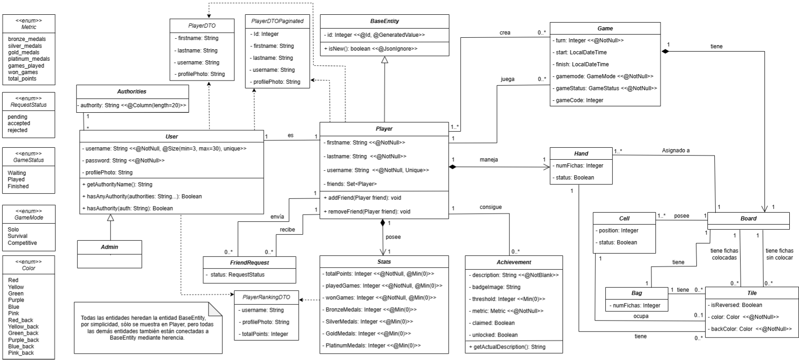
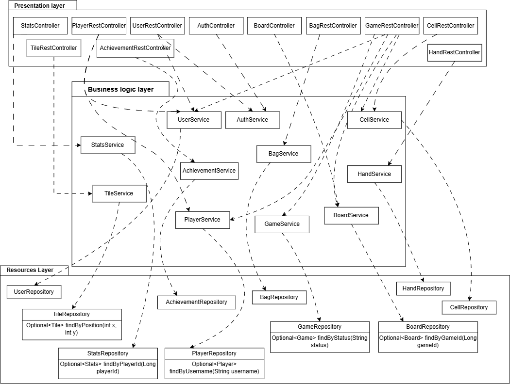
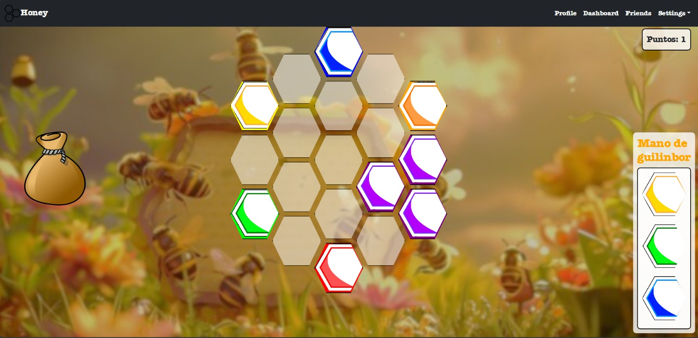

# Diseño del Sistema

## Introducción

**Honey** es el juego sobre el que vamos a basar nuestro proyecto. Se trata de un juego de estrategia apto para todas las edades y para jugar en cualquier momento del día. Vamos a desarrollar su versión online, con el objetivo de ofrecer una experiencia accesible y entretenida para todo tipo de jugadores.

Es un juego en el que pueden participar desde una persona hasta cuatro. El juego incluye:
- 1 tablero principal en forma de panal de abeja, formado por 19 hexágonos.
- 72 piezas de miel.

La flexibilidad que ofrece **Honey** se caracteriza porque se puede disfrutar de él de 3 formas distintas, que implementaremos en la versión online:

### Modos de Juego

1. **Modo solitario (Solo Mode)**  
   Juega una única persona, con el objetivo de vaciar el tablero de las fichas de miel mediante la formación de grupos de al menos 3 fichas del mismo color en el tablero. Cada vez que logras una combinación, ganas puntos. A medida que acumulas puntos, podrás colocar más fichas en tu mano y usar estrategias para eliminar todas las fichas del tablero y ganar.

2. **Modo multijugador (Multiplayer Mode)**  
   Juegan de 2 a 4 personas, y el objetivo principal es acumular la mayor cantidad de puntos posible. Los jugadores deben formar coincidencias de al menos 3 fichas del mismo color en el tablero para obtener puntos. Al final del juego, el jugador con la mayor puntuación será declarado el ganador.

3. **Modo superviviente (Survival Mode)**  
   Juega una única persona, y el objetivo es formar grupos de al menos tres fichas del mismo color en el tablero y eliminarlas progresivamente para vaciar el tablero.

### Pasos para Jugar

#### Modo Solitario (Solo Mode)

1. El tablero está vacío y el jugador inicia la partida con un **hand size** de 1 y una **puntuación** de 0.
2. El jugador comienza sacando una ficha de la bolsa:
   - Si el color de la cara vacía de la ficha escogida no está en las esquinas del tablero, el jugador debe poner la ficha con esa cara vacía hacia arriba, comenzando por la esquina superior derecha en el sentido de las agujas del reloj.
   - Si el color de la ficha ya está en el tablero, se descarta la ficha.
   - Continúa así hasta completar todas las 6 esquinas del tablero.
3. Una vez completadas las 6 esquinas con todos los colores de fichas disponibles con su lado vacío hacia arriba, se añaden las fichas descartadas del paso anterior en la bolsa.
4. Inicio de partida: A partir de aquí se pueden ver ambas caras de las fichas.
   - En la primera ronda, podrás coger solo 1 ficha al tener un **hand size** de 1, la cual deberás colocar en el tablero.
5. El jugador debe colocar estratégicamente la ficha para lograr la primera combinación de 3 o más fichas.
6. Si logra una combinación, se voltea la ficha y se gana un punto, aumentando el **hand size** en 1 por cada combinación.

#### Modo Superviviente (Survival Mode)

1. El tablero está vacío y el jugador inicia la partida con un **hand size** de 1 y una **puntuación** de 0.
2. El jugador empieza sacando una ficha de la bolsa:
   - Si el color de la cara vacía de la ficha escogida no está en las esquinas del tablero, el jugador debe poner la ficha con esa cara vacía hacia arriba, comenzando por la esquina superior derecha en el sentido de las agujas del reloj.
   - Si el color de la ficha ya está en el tablero, se descarta la ficha.
   - Continúa así hasta completar todas las 6 esquinas del tablero.
3. El jugador puede elegir tantas fichas como quiera, pero sin ver la cara llena, y colocarlas en el tablero para hacer combinaciones.
4. El juego continúa hasta que se vacía el tablero o se pierde el juego.

#### Modo Multijugador (Multiplayer Mode)

1. El tablero está vacío, y todos los jugadores inician la partida con una puntuación de 0.
2. El primer jugador, escogido al azar, empieza sacando una ficha de la bolsa. 
3. Al sacar una ficha, el jugador puede:
   - Colocar la ficha en el tablero con la cara vacía hacia arriba.
   - Guardarse la ficha sin ponerla en el tablero.
4. El juego continúa en turnos y se forman combinaciones de fichas. El jugador que logre más puntos al final del juego es el ganador.

### Ranking de Puntuaciones

- **Modo Solitario (Solo Mode)**  
  - Bronce: si los puntos conseguidos < 0.
  - Plata: si los puntos conseguidos entre 1 y 10.
  - Oro: si los puntos conseguidos entre 11 y 20.
  - Platino: si los puntos conseguidos > 20.

- **Modo Superviviente (Survival Mode)**  
  - Bronce: si los puntos son menos de 55.
  - Plata: si los puntos son entre 55 y 65.
  - Oro: si los puntos son más de 65.
  - Platino: si solo quedan las esquinas.

- **Modo Multijugador (Multiplayer Mode)**  
  - El ganador es quien tenga mayor puntuación.


[Enlace al vídeo de explicación de las reglas del juego / partida jugada por el grupo](https://www.youtube.com/watch?v=0auTOvJf2NI&t=24s)

## Diagrama(s) UML:

### Diagrama de Dominio/Diseño


### Diagrama de Capas (incluyendo Controladores, Servicios y Repositorios)

# Relaciones entre Controladores y Servicios (Capa de Presentación y Capa de Lógica de Negocio)

- **UserRestController ➔ UserService**: El `UserRestController` utiliza `UserService` para gestionar operaciones relacionadas con el usuario, como registro, autenticación y gestión de perfiles.
- **AuthController ➔ AuthService**: El `AuthController` interactúa con `AuthService` para la autenticación y autorización, manejando solicitudes de login y token de sesión.
- **PlayerRestController ➔ PlayerService**: Permite gestionar el perfil del jugador y sus estadísticas, como obtener el perfil o actualizar su información.
- **GameRestController ➔ GameService**: `GameRestController` utiliza `GameService` para iniciar, pausar o finalizar partidas, y para recuperar el estado del juego.
- **BoardController ➔ BoardService**: Permite gestionar el tablero del juego, como cargar el tablero y actualizarlo a través de `BoardService`.
- **CellRestController ➔ CellService**: `CellRestController` utiliza `CellService` para realizar acciones sobre celdas específicas, como mover piezas o interactuar con ellas.
- **TileRestController ➔ TileService**: Gestiona la lógica de las fichas o tiles en el juego, como obtener fichas disponibles o colocarlas en el tablero.
- **BagRestController ➔ BagService**: Permite el manejo de la "bolsa" de objetos o recursos de un jugador, como los recursos de miel en el juego.
- **HandRestController ➔ HandService**: `HandService` es responsable de gestionar las fichas que un jugador tiene "en mano" o listas para jugar.
- **StatsController ➔ StatsService**: `StatsController` utiliza `StatsService` para gestionar y consultar las estadísticas del jugador.
- **AchievementController ➔ AchicevementService**: `AchievementController` interactúa con `AchicevementService` para consultar y actualizar los logros de los jugadores.


# Relaciones entre Servicios y Repositorios (Capa de Lógica de Negocio y Capa de Recursos)

- **UserService ➔ UserRepository**: `UserService` utiliza `UserRepository` para acceder y gestionar datos de usuario, como búsqueda de usuarios por nombre o autenticación.
- **PlayerService ➔ PlayerRepository**: `PlayerService` se apoya en `PlayerRepository` para obtener datos específicos del jugador, como su puntaje o nivel.
- **GameService ➔ GameRepository**: `GameService` utiliza `GameRepository` para gestionar datos del juego, como obtener partidas activas o recuperar una partida por estado.
- **BoardService ➔ BoardRepository**: `BoardService` accede a `BoardRepository` para recuperar o actualizar el estado del tablero de juego.
- **CellService ➔ CellRepository**: `CellService` interactúa con `CellRepository` para gestionar las celdas del tablero, como buscar celdas específicas por coordenadas.
- **TileService ➔ TileRepository**: `TileService` utiliza `TileRepository` para obtener y manipular las fichas en el juego, como obtener fichas de tipo específico o posición en el tablero.
- **BagService ➔ BagRepository**: `BagService` accede a `BagRepository` para gestionar los recursos o elementos en la bolsa de un jugador.
- **HandService ➔ HandRepository**: `HandService` utiliza `HandRepository` para gestionar las fichas que un jugador tiene disponibles para jugar en su "mano".
- **StatsService ➔ StatsRepository**: `StatsService` interactúa con `StatsRepository` para consultar y actualizar las estadísticas de los jugadores.
- **AchievementService ➔ AchicevementRepository**: `AchievementService` interactúa con `AchievementRepository` para consultar y actualizar los logros de los jugadores.
  
# Ejemplos de Consultas Personalizadas en Repositorios

### UserRepository
- `Optional<User> findByUsername(String username)`: Para buscar un usuario por su nombre, útil en autenticación y perfil.
- `Iterable<User> findAllByAuthority(String auth)`: Para buscar todos los usuarios que tengan autiridad.

### PlayerRepository
- `Optional<Player> findByUsername(String username)`: Recupera un jugador por nombre de usuario.
- `List<Player> findByScoreGreaterThan(int score)`: Obtiene jugadores con puntajes altos, útil para clasificaciones o rankings.
- `List<Player> findByLevel(int level)`: Encuentra jugadores en un nivel específico.

### GameRepository
- `Optional<Game> findByStatus(String status)`: Busca partidas por estado (e.g., "in-progress", "completed").
- `List<Game> findByPlayerId(Long playerId)`: Encuentra todas las partidas en las que un jugador específico ha participado.

### BoardRepository
- `Optional<Board> findByGameId(Long gameId)`: Recupera el tablero asociado a una partida.
- `List<Board> findByPlayerId(Long playerId)`: Encuentra tableros asociados a un jugador (si hay múltiples).

### TileRepository
- `List<Tile> findByBoardId(Long boardId)`: Obtiene todas las fichas en un tablero.
- `List<Tile> findByType(String type)`: Recupera fichas de un tipo específico (e.g., "Honey", "Obstacle").
- `Optional<Tile> findByPosition(int x, int y)`: Encuentra una ficha por coordenadas.

### CellRepository
- `List<Cell> findByBoardId(Long boardId)`: Obtiene todas las celdas de un tablero.
- `Optional<Cell> findByCoordinatesAndBoardId(int x, int y, Long boardId)`: Recupera una celda por sus coordenadas.

### HandRepository
- `List<Tile> findByPlayerId(Long playerId)`: Encuentra todas las fichas en la "mano" de un jugador.
- `Optional<Tile> findTopByPlayerIdOrderByAddedDateDesc(Long playerId)`: Encuentra la ficha más reciente en la mano del jugador.

### BagRepository
- `List<Item> findByBagId(Long bagId)`: Encuentra todos los elementos en una bolsa específica.
- `Optional<Item> findTopByBagIdAndTypeOrderByAddedDateDesc(Long bagId, String type)`: Recupera el elemento más reciente de un tipo específico en la bolsa.

### StatsRepository
- `Optional<Stats> findByPlayerId(Long playerId)`: Recupera estadísticas de un jugador específico.
- `List<Stats> findAllOrderedByTotalPoints()`: Obtiene mejores jugadores por puntos totales, útil para rankings.
  
### AchicevementRepository
- `Optional<List<Achievement>> findAchievementsByUsername(@Param("username") String username)`: Obtiene los logros de un usuario en concreto según su nombre de usuario.
- `Optional<Achievement> findSpecificAchievementByUsername(@Param("username") String username, @Param("id") int id)`: Recupera un logro en concreto según el id de un usuario en concreto segun se nombre de usuario.

## Descomposición del mockups del tablero de juego en componentes

En esta sección procesaremos el mockup del tablero de juego (o los mockups si el tablero cambia en las distintas fases del juego). Etiquetaremos las zonas de cada una de las pantallas para identificar componentes a implementar. Para cada mockup se especificará el árbol de jerarquía de componentes, así como, para cada componente el estado que necesita mantener, las llamadas a la API que debe realizar y los parámetros de configuración global que consideramos que necesita usar cada componente concreto. 
Por ejemplo, para la pantalla de visualización de métricas del usuario en un hipotético módulo de juego social:



# Pantalla Principal (Tablero de Juego)

## Componentes principales:
- **Board**: Componente principal que muestra el tablero con las celdas hexagonales.
- **Hexagon**: Celdas hexagonales individuales que pueden contener una ficha (tile).
- **TileComponent**: Muestra la ficha (tile) en cada celda, con posibilidad de voltearse.
- **PointsDisplay**: Muestra la puntuación actual del jugador.
- **Hand (Mano del jugador)**: Área donde el jugador puede ver las fichas disponibles para colocar en el tablero.

## Árbol de Jerarquía de Componentes:
- **Board**
  - **Hexagon** (por cada celda del tablero)
    - **TileComponent** (si hay una ficha en la celda)
- **PointsDisplay** (para mostrar la puntuación del jugador)
- **Hand** (contiene fichas del jugador)

## Estados:
- `gameId`: ID único de la partida actual.
- `points`: Puntuación del jugador.
- `username`: Nombre de usuario autenticado.
- `allTiles`: Arreglo con todas las fichas del juego.
- `tableroId`: ID del tablero.
- `cells`: Lista de celdas del tablero, cada una puede contener una ficha.
- `selectedTile`: Ficha seleccionada de la mano del jugador para colocar en el tablero.
- `hand`: Lista de fichas en la mano del jugador.
- `bolsa`: Bolsa de fichas disponibles para la partida.
- `notificacionId`, `notificacionId2`, `prueba`, `notificacionInicio`, `hayMatch`: Estados relacionados con notificaciones y estado del juego.
- `startGame`: Indica si el juego ha comenzado.

## Llamadas API:
- `GET /api/v1/game/getGameId/{tableroId}`: Obtiene el gameId correspondiente al tableroId.
- `GET /api/v1/tile/all`: Obtiene todas las fichas (tiles) de la base de datos.
- `GET /api/v1/cell/all`: Obtiene todas las celdas del tablero.
- `GET /api/v1/bag/{tableroId}`: Obtiene la bolsa asociada a la partida.
- `PUT /api/v1/bag/{bolsa.id}`: Actualiza la bolsa en el backend.
- `GET /api/v1/hand/{username}`: Obtiene la mano del jugador basado en su username.
- `PUT /api/v1/cell/{id}`: Actualiza el estado de una celda en el backend.

# Pantalla de Mano del Jugador (Hand)

## Componentes principales:
- **TileComponent**: Cada ficha (tile) en la mano que puede ser seleccionada para colocarse en el tablero.
- **Hand**: Componente que muestra las fichas disponibles en la mano del jugador.

## Árbol de Jerarquía de Componentes:
- **Hand**
  - **TileComponent** (por cada ficha en la mano)

## Estados:
- `hand`: Lista de fichas del jugador.
- `isReversed`: Estado que indica si la ficha está volteada o no.

## Llamadas API:
- `GET /api/v1/hand/{username}`: Obtiene la mano del jugador.

# Pantalla de Notificaciones

## Componentes principales:
- **ToastNotification**: Componente que muestra las notificaciones en la pantalla (e.g., inicio del juego, error, etc.).
- **PointsDisplay**: Puede mostrar puntos actualizados después de realizar una acción.

## Árbol de Jerarquía de Componentes:
- **ToastNotification**
- **PointsDisplay**

## Estados:
- `notificacionId`, `notificacionId2`: Identificadores de las notificaciones activas.
- `hayMatch`: Estado que indica si se ha detectado una coincidencia en el tablero.

## Llamadas API:
- `GET /api/v1/game/start`: Inicia el juego.
- `GET /api/v1/cell/checkMatch`: Verifica si existe una coincidencia de fichas en el tablero.

# Descripción de los Componentes

## TileComponent
El componente `TileComponent` es el encargado de representar cada ficha en el tablero y en la mano del jugador. Permite que la ficha se voltee, y cambia de imagen dependiendo de si está en su lado delantero o trasero.

### Propiedades:
- `tile`: Ficha que contiene los detalles de color y el lado de la ficha.
- `onClick`: Función que se ejecuta al hacer clic en la ficha.
- `isInHand`: Booleano que determina si la ficha está en la mano del jugador o en el tablero.

### Estados:
- `isReversed`: Estado que determina si la ficha está volteada.

### Lógica:
- La imagen de la ficha se selecciona con base en el color y el estado de la reversa (`isReversed`).
- El evento de clic cambia el estado de la ficha, volteándola.

### Función getImageUrl:
Esta función selecciona la URL de la imagen de la ficha basada en el color y si está o no volteada.

function getImageUrl(color, backColor, isReversed) {
    const key = isReversed ? backColor : color;
    return cardImages[key];
}

## PointsDisplay
Este componente muestra la puntuación actual del jugador.

### Propiedades:
- **points**: Puntos actuales del jugador.

### Configuración de Estilo:
- Posicionamiento y visibilidad a través de CSS.

---

## Board
El componente **Board** es el contenedor principal que organiza las celdas hexagonales y maneja el estado del juego.

### Propiedades:
- **cells**: Lista de celdas en el tablero.
- **selectedTile**: Ficha seleccionada de la mano.
- **hand**: Lista de fichas del jugador.
- **startGame**: Indica si el juego ha comenzado.

### Funciones:
- **handleCellClick**: Maneja la lógica de clics sobre las celdas.
- **handleTileClick**: Maneja la selección de fichas de la mano del jugador.

### Parámetros de Configuración Necesarios
- **color**: Color de la ficha (e.g., "RED", "BLUE").
- **backColor**: Color del reverso de la ficha (e.g., "RED_BACK").
- **isReversed**: Booleano que indica si la ficha está volteada.
- **tile**: Objeto que representa la ficha (color, backColor, etc.).
- **isInHand**: Booleano que indica si la ficha está en la mano o en el tablero.


## Documentación de las APIs (ordenadas por orden alfabético):

## AchievementsController

### GET /api/v1/players/achievements
**Descripción:** Recupera la lista de logros disponibles para todos los jugadores.  
**Respuesta:** Devuelve un array de objetos `Achievement`, que contiene información sobre todos los logros en el sistema.

### POST /api/v1/players/achievements
**Descripción:** Crea un nuevo logro en el sistema a partir de un objeto `Achievement` en el cuerpo de la solicitud con los detalles del logro a crear.  
**Respuesta:** Devuelve el objeto `Achievement` creado junto con un código de estado HTTP 201 (Creado).

### DELETE /api/v1/players/achievements/{id}
**Descripción:** Elimina un logro específico del sistema según su ID.  
**Respuesta:** Devuelve un código de estado HTTP 204 (Sin contenido) si la eliminación es exitosa.

### GET /api/v1/players/achievements/{username}
**Descripción:** Recupera la lista de logros de un jugador específico según su nombre de usuario.  
**Respuesta:** Devuelve un array de objetos `Achievement` que representan los logros asociados al jugador.

### PUT /api/v1/players/achievements/{username}/claim/{id}
**Descripción:** Marca un logro como reclamado por un jugador específico proporcionando el nombre de usuario y el ID del logro en la URL.  
**Respuesta:** Devuelve el objeto `Achievement` actualizado indicando que ha sido reclamado por el jugador.

### GET /api/v1/players/achievements/achievement/{id}
**Descripción:** Recupera los detalles de un logro específico según su ID.  
**Respuesta:** Devuelve un objeto `Achievement` que contiene los detalles del logro solicitado.

---

## BagRestController

### GET /api/v1/bag/{tableroId}
**Descripción:** Obtiene el objeto Bag asociado a un tablero específico, identificado por tableroId.  
**Respuesta:** Devuelve el objeto Bag correspondiente. Si no se encuentra el tablero, lanza una excepción de "Recurso no encontrado".

---

## CellRestController

### GET /api/v1/cell/all
**Descripción:** Recupera la lista de todas las celdas en el sistema.  
**Respuesta:** Devuelve una lista de objetos Cell, que representa cada celda existente.

### GET /api/v1/cell/{id}
**Descripción:** Recupera una celda específica por su id.  
**Respuesta:** Devuelve el objeto Cell correspondiente al identificador dado.

### PUT /api/v1/cell/{id}
**Descripción:** Actualiza el estado (status) de una celda específica, indicado por id. Este estado cambia cuando se coloca o se retira una ficha en la celda.  
**Cuerpo de la solicitud:** Recibe un valor booleano (status) que indica el nuevo estado de la celda.  
**Respuesta:** Devuelve el objeto Cell con el estado actualizado.

---

## GameRestController

### GET /api/v1/game
**Descripción:** Recupera la lista de todas las partidas existentes en el sistema.  
**Respuesta:** Devuelve un array de objetos `Game`, que contiene la información de cada partida.

### POST /api/v1/game
**Descripción:** Crea un nuevo juego.  
**Cuerpo de la solicitud:** Recibe un objeto Game en JSON, validado.  
**Respuesta:** Devuelve el objeto Game creado y la URI de localización del nuevo recurso.

### PATCH /api/v1/game/{gameCode}/join
**Descripción:** Permite a un jugador unirse a una partida utilizando el código de la partida.  
**Respuesta:** Devuelve el objeto `Game` actualizado con la lista de jugadores.

### PUT /api/v1/game/{gameId}/addPlayer/{playerId}
**Descripción:** Añade un jugador identificado por `playerId` a un juego específico identificado por `gameId`.  
**Respuesta:** Devuelve el objeto Game actualizado con el nuevo jugador añadido.

### PUT /api/v1/game/{gameId}/status
**Descripción:** Actualiza el estado (status) de un juego específico identificado por `gameId`, recibe un mapa JSON con la clave `gameStatus` que especifica el nuevo estado del juego.  
**Respuesta:** Devuelve el objeto Game actualizado con el nuevo estado.

### GET /api/v1/game/{id}
**Descripción:** Recupera un juego específico por su id.  
**Respuesta:** Devuelve el objeto Game correspondiente. Lanza una excepción de "Recurso no encontrado" si no se encuentra el juego.

### PUT /api/v1/game/{id}
**Descripción:** Actualiza un juego existente identificado por id, recibe un objeto Game con los datos actualizados, excluyendo el id.  
**Respuesta:** Respuesta vacía con código 204 No Content si la actualización es exitosa.

### DELETE /api/v1/game/{id}
**Descripción:** Elimina un juego específico identificado por id.  
**Respuesta:** Respuesta vacía con código 204 No Content si la eliminación es exitosa.

### GET /api/v1/game/{id}/checkPlaying
**Descripción:** Verifica si un jugador está jugando en una partida específica, identificada por su ID.  
**Respuesta:** Devuelve un objeto indicando si el jugador está activo en la partida.

### PATCH /api/v1/game/{id}/endGame
**Descripción:** Marca una partida específica como finalizada, identificada por su ID.  
**Respuesta:** Devuelve el objeto `Game` actualizado con el estado finalizado.

### PATCH /api/v1/game/{id}/startGame
**Descripción:** Inicia una partida específica, identificada por su ID.  
**Respuesta:** Devuelve el objeto `Game` actualizado con el estado iniciado.

### GET /api/v1/game/code/{codigoDePartida}
**Descripción:** Recupera los detalles de una partida utilizando su código único.  
**Respuesta:** Devuelve un objeto `Game` con la información de la partida asociada al código proporcionado.

### PUT /api/v1/game/code/{codigoDePartida}/join/{username}
**Descripción:** Permite a un jugador unirse a una partida utilizando el código de la partida y su nombre de usuario.  
**Respuesta:** Devuelve el objeto `Game` actualizado con la lista de jugadores.

### GET /api/v1/game/getGameId/{tableroId}
**Descripción:** Obtiene el `gameId` asociado a un tablero específico identificado por `tableroId`.  
**Respuesta:** Devuelve el `gameId` asociado. Si no se encuentra, responde con 404 Not Found.

### POST /api/v1/game/new
**Descripción:** Crea un nuevo juego con un modo de juego específico y asocia jugadores, un tablero y manos iniciales, recibe un mapa JSON con la clave `gameMode` que especifica el modo de juego.  
**Respuesta:** Devuelve un JSON con `gameId` y `tableroId` del nuevo juego creado.

### GET /api/v1/game/player/{username}/{status}
**Descripción:** Recupera las partidas en las que un jugador específico está participando, filtradas por el estado de la partida.  
**Respuesta:** Devuelve un array de objetos `Game` en los que el jugador está participando con el estado proporcionado.

### GET /api/v1/game/status/{status}
**Descripción:** Recupera las partidas filtradas por un estado específico, como "en progreso" o "finalizado".  
**Respuesta:** Devuelve un array de objetos `Game` que corresponden al estado solicitado.

---

## HandRestController

### GET /api/v1/hand
**Descripción:** Recupera todas las manos almacenadas en el sistema.  
**Respuesta:** Devuelve una lista de objetos Hand.

### GET /api/v1/hand/{username}
**Descripción:** Obtiene la mano asociada al nombre de usuario del jugador.  
**Respuesta:** Devuelve el objeto Hand correspondiente. Si no se encuentra, responde con 404 Not Found.

### PUT /api/v1/hand/{id}/numFichas
**Descripción:** Actualiza el número de fichas en una mano específica, calculado a partir de las fichas actuales en esa mano.  
**Respuesta:** Devuelve el objeto Hand actualizado.

### POST /api/v1/hand
**Descripción:** Crea una nueva mano y la guarda en la base de datos.  
**Cuerpo de la solicitud:** Recibe un objeto Hand en JSON.  
**Respuesta:** Devuelve el objeto Hand creado con estado 201 Created.

### PUT /api/v1/hand/{id}
**Descripción:** Actualiza los detalles de una mano específica.  
**Cuerpo de la solicitud:** Recibe un objeto Hand con los datos actualizados.  
**Respuesta:** Devuelve el objeto Hand actualizado. Responde con 404 Not Found si la mano no existe.

### DELETE /api/v1/hand/{id}
**Descripción:** Elimina una mano específica por su id.  
**Respuesta:** Respuesta vacía con estado 204 No Content si la eliminación es exitosa.

### POST /api/v1/hand/{id}/addTile
**Descripción:** Añade una ficha (Tile) específica a una mano.  
**Cuerpo de la solicitud:** Recibe un objeto Tile en JSON.  
**Respuesta:** Devuelve el objeto Hand actualizado con la nueva ficha añadida. Responde con 404 Not Found si la mano no existe.

### POST /api/v1/hand/{id}/removeTile
**Descripción:** Elimina una ficha (Tile) específica de una mano.  
**Cuerpo de la solicitud:** Recibe un objeto Tile en JSON.  
**Respuesta:** Devuelve el objeto Hand actualizado con la ficha eliminada. Responde con 404 Not Found si la mano no existe.

---

## PlayerRestController

### GET /api/v1/players
**Descripción:** Recupera una lista de todos los jugadores registrados.  
**Respuesta:** Devuelve una lista de objetos Player.

### POST /api/v1/players
**Descripción:** Crea un nuevo jugador en el sistema.  
**Entrada:** Recibe un objeto JSON con la información necesaria para crear el jugador, incluyendo `username`, `firstname`, `lastname`, y cualquier otro campo requerido.  
**Respuesta:** Devuelve el objeto del jugador recién creado con su información.

### DELETE /api/v1/players/{id}
**Descripción:** Elimina un jugador del sistema, identificado por su ID.  
**Respuesta:** Devuelve un mensaje de confirmación indicando que el jugador ha sido eliminado exitosamente.

### PUT /api/v1/players/{playerId}
**Descripción:** Actualiza la información de un jugador existente, identificado por su ID.  
**Entrada:** Recibe un objeto JSON con los campos que se desean actualizar del jugador.  
**Respuesta:** Devuelve el objeto del jugador actualizado con los nuevos datos.

### GET /api/v1/players/{username}
**Descripción:** Obtiene la información de un jugador específico por nombre de usuario.  
**Respuesta:** Devuelve el objeto Player correspondiente al username proporcionado.

### GET /api/v1/players/{username}/friends
**Descripción:** Obtiene todos los amigos del jugador especificado.  
**Respuesta:** Devuelve una lista de objetos Player que representan los amigos del jugador.

### GET /api/v1/players/{username}/onlineFriends
**Descripción:** Recupera la lista de amigos en línea de un jugador, identificado por su nombre de usuario.  
**Respuesta:** Devuelve una lista de amigos que actualmente están en línea.

### GET /api/v1/players/{username}/pending-requests
**Descripción:** Recupera la lista de solicitudes de amistad pendientes de un jugador, identificado por su nombre de usuario.  
**Respuesta:** Devuelve una lista de solicitudes de amistad que aún no han sido aceptadas o rechazadas.

### DELETE /api/v1/players/{username}/remove-friend/{friendUsername}
**Descripción:** Elimina a un amigo de la lista de amigos de un jugador, identificado por su nombre de usuario y el nombre del amigo.  
**Respuesta:** Devuelve un mensaje de confirmación indicando que el amigo ha sido eliminado exitosamente.

### POST /api/v1/players/{username}/respond-friend-request/{requestId}
**Descripción:** Responde a una solicitud de amistad recibida, aceptándola o rechazándola.  
**Cuerpo de solicitud:** Un mapa JSON con una clave `status` que contiene el estado de respuesta (ACCEPTED o REJECTED).  
**Respuesta:** Responde con un 200 OK si la respuesta fue procesada correctamente.

### POST /api/v1/players/{username}/send-friend-request/{receiverUsername}
**Descripción:** Envía una solicitud de amistad del jugador especificado a otro jugador.  
**Respuesta:** Responde con un 200 OK si la solicitud fue enviada exitosamente.

### GET /api/v1/players/currentPlayer
**Descripción:** Obtiene el usuario actual basado en la autenticación.  
**Respuesta:** Devuelve el objeto User del jugador actual. Si ocurre un error, se devuelve un mensaje de error en el cuerpo de la respuesta.

### GET /api/v1/players/id/{playerId}
**Descripción:** Recupera los detalles de un jugador específico, identificado por su ID único.  
**Respuesta:** Devuelve un objeto `Player` con información detallada del jugador solicitado.

### GET /api/v1/players/paginated
**Descripción:** Recupera una lista paginada de jugadores.  
**Respuesta:** Devuelve un objeto con los siguientes campos:  
- `players`: Lista de jugadores en la página actual.  
- `currentPage`: Número de la página actual.  
- `totalPages`: Número total de páginas disponibles.

---

## StatsController

### GET /api/v1/players/stats
**Descripción:** Recupera las estadísticas de todos los jugadores.  
**Respuesta:** Devuelve una lista de objetos Stats, cada uno representando las estadísticas de un jugador.

### GET /api/v1/players/stats/{username}
**Descripción:** Recupera las estadísticas de un jugador específico basado en su nombre de usuario.  
**Respuesta:** Devuelve el objeto Stats correspondiente al username proporcionado.

### PUT /api/v1/players/stats/{username}/{estadoPartida}
**Descripción:** Recupera las estadísticas de un jugador específico basado en su nombre de usuario y el estado de la partida.  
**Respuesta:** Devuelve el objeto Stats actualizado según los datos introducidos en el path y los puntos ganados en la partida dados en la request.

### GET /api/v1/players/stats/ranking
**Descripción:** Recupera las estadísticas de los jugadores ordenados de mayor a menos según los puntos para obtener el ranking de jugadores.
**Respuesta:** Devuelve el objeto PlayerRankingDTO correspondiente a a todos los usuarios, que incluye usuario, foto de perfil y total de puntos.

---

## TileRestController

### GET /api/v1/tile/all
**Descripción:** Recupera todas las fichas (Tile) almacenadas en el sistema.  
**Respuesta:** Devuelve una lista de objetos Tile que representa todas las fichas disponibles.

---

## UserRestController

### GET /api/v1/users
**Descripción:** Recupera a todos los usuarios del sistema. Si se proporciona un parámetro `auth`, devuelve solo los usuarios con esa autoridad.  
**Parámetros de solicitud:**
- `auth` (opcional): filtro para mostrar usuarios con una autoridad específica.  
**Respuesta:** Devuelve una lista de objetos User.

### GET /api/v1/users/authorities
**Descripción:** Recupera todas las autoridades (Authorities) disponibles en el sistema.  
**Respuesta:** Devuelve una lista de objetos Authorities.

### GET /api/v1/users/{id}
**Descripción:** Obtiene un usuario específico por su id.  
**Respuesta:** Devuelve el objeto User correspondiente al id.

### GET /api/v1/users/username/{username}
**Descripción:** Recupera un usuario por su nombre de usuario (username).  
**Respuesta:** Devuelve el objeto User correspondiente al username.

### POST /api/v1/users
**Descripción:** Crea un nuevo usuario.  
**Cuerpo de la solicitud:** Recibe un objeto User en JSON, validado.  
**Respuesta:** Devuelve el objeto User creado con estado 201 Created.

### PUT /api/v1/users/{userId}
**Descripción:** Actualiza la información de un usuario específico.  
**Cuerpo de la solicitud:** Recibe un objeto User con los datos actualizados.  
**Respuesta:** Devuelve el objeto User actualizado con estado 200 OK.

### DELETE /api/v1/users/{userId}
**Descripción:** Elimina un usuario específico por su `userId`. El usuario actual no puede eliminarse a sí mismo.  
**Respuesta:** Devuelve un mensaje de confirmación "User deleted!". Si el usuario intenta eliminarse a sí mismo, se lanza una excepción de "Acceso denegado".

---


## Patrones de diseño y arquitectónicos aplicados

### Patrón: Model-View-Controller (MVC)
**Tipo:** Arquitectónico  
**Contexto de Aplicación:**  
Este patrón se ha aplicado para separar la lógica de negocio de la presentación. En este caso, se usa en el paquete `user`, donde el controlador `UserRestController` maneja las peticiones de usuario, mientras que `UserService` maneja la lógica de negocio relacionada con el usuario, y `UserRepository` interactúa con la base de datos.

**Clases o Paquetes Creados:**  
- `user.UserRestController`  
- `user.UserService`  
- `user.UserRepository`  

**Ventajas Alcanzadas al Aplicar el Patrón:**  
Separar las responsabilidades mejora la mantenibilidad del código, permitiendo cambiar la lógica de negocio sin afectar la capa de presentación y viceversa. Además, facilita las pruebas unitarias e integración.

---

### Patrón: Service Layer (Capa de Servicio)
**Tipo:** Arquitectónico  
**Contexto de Aplicación:**  
Aplicado en la capa de lógica de negocio para encapsular las operaciones de negocio en clases de servicio. `UserService` y `AuthoritiesService` en el paquete `user` implementan la lógica de negocio para usuarios y autorizaciones, aislando las operaciones del controlador.

**Clases o Paquetes Creados:**  
- `user.UserService`  
- `user.AuthoritiesService`  
- `bag.BagService`  
- `board.BoardService`  
- `cell.CellService`  
- `game.GameService`  
- `hand.HandService`  
- `player.PlayerService`  
- `stats.StatsService`  
- `tile.TileService`  

**Ventajas Alcanzadas al Aplicar el Patrón:**  
Permite una separación clara entre lógica de negocio y presentación, mejorando la modularidad y haciendo más fácil la reutilización de servicios en diferentes controladores o contextos. Esto también simplifica las pruebas unitarias de la lógica de negocio.

---

### Patrón: Repository (Repositorio)
**Tipo:** de Diseño  
**Contexto de Aplicación:**  
Se usa para abstraer la interacción con la base de datos en clases que se encargan de manejar la persistencia de los datos de `User` y `Authorities`. Los repositorios se encuentran en el paquete `user` (`UserRepository` y `AuthoritiesRepository`).

**Clases o Paquetes Creados:**  
- `user.UserRepository`  
- `user.AuthoritiesRepository`
-  acvhievement.StatsRepository`
- `bag.BagRepository`  
- `board.BoardRepository`  
- `cell.Cellrepository`  
- `friendrequest.FriendRequestRepository`  
- `game.GameRepository`  
- `hand.HandRepository`  
- `player.PlayerRepository`  
- `stats.StatsRepository`  
- `tile.TileRepository`  

**Ventajas Alcanzadas al Aplicar el Patrón:**  
Este patrón permite cambiar el almacenamiento de datos sin modificar el resto de la aplicación. También facilita las pruebas al permitir usar implementaciones simuladas o en memoria de los repositorios.

---

### Patrón: Dependency Injection (Inyección de Dependencias)
**Tipo:** Arquitectónico  
**Contexto de Aplicación:**  
Se aplica en toda la aplicación a través del framework Spring para gestionar la inyección de dependencias en clases como `UserService`, `AuthoritiesService`, `UserRepository`, etc. La inyección de dependencias se realiza principalmente a través de anotaciones como `@Autowired`.

**Clases o Paquetes Creados:**  
No crea nuevas clases, pero se aplica en clases de servicios y controladores en los paquetes `user` y `game`.

**Ventajas Alcanzadas al Aplicar el Patrón:**  
Este patrón facilita la gestión de dependencias y reduce el acoplamiento entre componentes, permitiendo cambiar implementaciones sin modificar el código cliente. También mejora la capacidad de prueba al poder inyectar mocks o stubs.

---

### Patrón: DTO (Data Transfer Object)
**Tipo:** de Diseño  
**Contexto de Aplicación:**  
Se podría aplicar para transferir datos entre el cliente y el servidor sin exponer directamente las entidades del dominio. Aunque no se observa en las clases mostradas, es común crear DTOs para `User`, `Player`, o `Match` si se necesita simplificar y controlar los datos expuestos al frontend.

**Clases o Paquetes Creados:**  
Ejemplo: `player.PlayerDTO`,`player.PlayerDTOPaginated` o `stats.PlayerRankingDTO`.

**Ventajas Alcanzadas al Aplicar el Patrón:**  
Los DTOs permiten un control fino sobre los datos que se envían al cliente, mejorando la seguridad y la eficiencia al reducir la carga de datos innecesarios y ocultar detalles internos del modelo de dominio.


## Decisiones de diseño
_En esta sección describiremos las decisiones de diseño que se han tomado a lo largo del desarrollo de la aplicación que vayan más allá de la mera aplicación de patrones de diseño o arquitectónicos._

### Decisión 1
## Tablero del juego

**Problema:**  
El tablero de este juego tiene una forma poco común, como se puede apreciar a simple vista. Diseñar un tablero para que sobre él se puedan aplicar las operaciones y jugadas de una partida se hizo complejo.

**Alternativas:**  
1. Pensamos en poner una tabla incompleta en la que algunas filas y columnas estuvieran siempre “vacías” y sin uso.  
2. Contenedores en forma de hexágono posicionados como el tablero.

**Ventajas:**  
1. Sencillez y rapidez de implementación.  
2. Facilidad para poner una ficha hexagonal completa.

**Desventajas:**  
1. Complejidad al intentar asemejar el tablero que queríamos lograr.  
2. Hay que crear componentes con una forma específica y darles unas coordenadas.

**Solución aportada:**  
Creación de un tablero formado por contenedores en forma de hexágono, alineados por columnas y filas (que no están alineadas como una tabla) en el que cada casilla tiene un “id” para saber la posición de cada una. Sobre las casillas se pondrán las fichas.

---
### Decisión 2
## Matches

**Problema:**  
Para ganar puntos, básicamente, tenemos que alinear fichas del mismo color; el problema era cómo saber que se han alineado tres fichas del mismo color.

**Alternativas:**  
1. Que cada ficha tuviera una posición que va cambiando dependiendo de dónde se va poniendo en el tablero.  
2. Crear una entidad “cell” que represente una casilla del tablero y estas sean las que miren si las casillas vecinas tienen ficha para hacer match.

**Ventajas:**  
1. Sin añadir más entidades, sencillo.  
2. Facilidad para resolver las combinaciones de fichas que den punto.

**Desventajas:**  
1. Dificultad de saber si hay combinación de ficha para esas posiciones.  
2. Hay que crear una nueva entidad.

**Solución aportada:**  
Cada entidad casilla tiene una posición, esa posición tiene “vecinos” en un “map” de esta manera: `{casilla, lista de casillas vecinas}`. Cuando se pone una ficha en una casilla, la casilla tiene un atributo “boolean” que se vuelve “true” y comprueba si las casillas vecinas tienen ficha y si su ficha es del mismo color. Si un vecino tiene ficha del mismo color, se buscan los vecinos de ese anterior vecino y si se encuentra otro con ficha del mismo color, ganas un punto. Este funcionamiento lo hemos basado como si fuera un grafo.

---
### Decisión 3
## Bóton de logout

**Problema:**  
Decidir la ubicación del botón de logout. Queríamos ubicarlo de tal manera que fuera fácil de encontrar pero que no incentivara al jugador a salir del juego rápidamente.

**Alternativa:**  
1. Colocar el botón de logout en la barra de navegación para fácil acceso.  
2. Situarlo dentro del menú de configuración (settings) del juego, haciendo que esté disponible pero no tan visible.

**Ventajas:**  
1. Logout en settings: Posicionarlo en el menú de configuración reduce la visibilidad del botón de salida, lo cual mantiene al jugador inmerso en el juego y aumenta el tiempo que permanece dentro.  
2. Logout en la barra de navegación: Fácil acceso, el jugador podría salir rápidamente si así lo desea.

**Desventajas:**  
1. Logout en settings: Puede ser menos intuitivo para jugadores que buscan salir rápidamente.  
2. Logout en la barra de navegación: Fácil acceso, lo que puede hacer que el jugador salga del juego más rápidamente, disminuyendo el tiempo de permanencia.

**Solución aportada:**  
Decidimos colocar el botón de logout dentro de la sección de configuración (settings), permitiendo que el jugador se enfoque más en el juego sin la tentación constante de salir. Esta solución también fomenta una experiencia de juego más continua.

---
### Decisión 4
## Entidad Player

**Problema:**  
Establecer una relación de herencia con la entidad User. Por falta de tiempo en ese momento no pudimos establecer la herencia de la forma que queríamos.

**Alternativas:**  
1. Añadir una propiedad `userId` para asociar un `User` a un `Player`.  
2. Establecer una relación `oneToOne` haciendo que la propiedad sea de tipo `User`.

**Ventajas:**  
1. Al establecer una única propiedad `userId`, el código se vuelve mucho más sencillo a la hora de releerlo o de realizar distintas modificaciones.  
2. Mediante la notación “CascadeType.ALL” establecemos persistencia entre `User` y `Player`, para que las operaciones que realicemos sobre `Player` se realicen también sobre el `User` asociado, y además podamos obtener todas las propiedades de `User` desde el `Player`.

**Desventajas:**  
1. Dificultad a la hora de obtener propiedades clave que eran únicas del usuario, como la contraseña, y falta de persistencia en las operaciones que se realizaban sobre el `Player`.  
2. Las peticiones POST se vuelven un poco más tediosas de realizar al tener que rellenar los campos de `Player` y los de `User` en un solo cuerpo.

**Solución aportada:**  
Finalmente nos decidimos por establecer la propiedad `User` en `Player`, creando una relación OneToOne entre `User` y `Player`. De esta forma, podríamos acceder a todos los datos de cada jugador de forma muy sencilla, ya que también se incluyen los datos de los usuarios. Esto nos resulta muy útil ya que en prácticamente todas las clases trabajamos con la entidad `Player`, no con `User`.

---
### Decisión 5
## CRUD sobre players siendo Admin

**Problema:**  
Estas operaciones venían implementadas sobre el proyecto base, pero se realizaban al `User`, de forma que te daba la opción de realizar estas acciones sobre jugadores y administradores, lo cual es algo que no tenía mucho sentido. Nuestro objetivo era realizar esto únicamente sobre los jugadores.

**Alternativa:**  
1. Eliminar en frontend el campo del formulario donde te da la opción de elegir el tipo de rol (Player o Admin), y establecer que éste siempre sea un jugador.  
2. Realizar la llamada a la API de `Player` en vez de realizarla a la API de `User`.

**Ventajas:**  
1. Apenas tendrías que modificar el código del proyecto base.  
2. Todas las operaciones realizadas garantizan la persistencia entre `Player` y `User`.

**Desventajas:**  
1. Realizándolo de esta manera no se creaba la entidad `Player` asociada al `User`, sería necesario la modificación de los controladores y servicios de esta entidad (User).  
2. La única desventaja era el desarrollo de nuevos métodos del controlador `PlayerRestController` y modificar las peticiones enviadas desde frontend, sobre todo a la hora de crear y actualizar `Players`.

**Solución aportada:**  
Vimos más conveniente crear métodos en el controlador de `Player`, ya que, con la relación que habíamos establecido, la persistencia era asegurada.

## Refactorizaciones aplicadas

### Refactorización 1
En esta refactorización añadimos un mapa de parámetros al juego para personalizar la información precalculada de cada fase.

#### Estado inicial del código
```java
class Game {

    private String phase;
    private int score;
    // Otros atributos...

    // Métodos...
}
```

#### Estado del código refactorizado
```java
import java.util.Map;

class Game {
    private String phase;
    private int score;
    private Map<String, Object> parameters; // Mapa de parámetros para personalizar la información

    // Métodos...
}
```

#### Problema que nos hizo realizar la refactorización
Era difícil añadir información para implementar la lógica de negocio en cada fase del juego, que varía considerablemente.

#### Ventajas que presenta la nueva versión del código
Ahora podemos añadir fácilmente los datos necesarios al contexto del juego, lo que facilita la gestión de los turnos y jugadas.

---

### Refactorización 2
En esta refactorización separamos la lógica de autenticación en un servicio dedicado para mejorar la mantenibilidad y reutilización del código.

#### Estado inicial del código
```java
class AuthController {

    public ResponseEntity<?> authenticateUser(LoginRequest loginRequest) {
        // Lógica de autenticación...
    }

    public ResponseEntity<?> registerUser(SignupRequest signupRequest) {
        // Lógica de registro...
    }
}
```

#### Estado del código refactorizado
```java
class AuthController {

    @Autowired
    private AuthService authService;

    public ResponseEntity<?> authenticateUser(LoginRequest loginRequest) {
        return authService.authenticateUser(loginRequest);
    }

    public ResponseEntity<?> registerUser(SignupRequest signupRequest) {
        return authService.registerUser(signupRequest);
    }
}

class AuthService {
    public ResponseEntity<?> authenticateUser(LoginRequest loginRequest) {
        // Lógica de autenticación...
    }

    public ResponseEntity<?> registerUser(SignupRequest signupRequest) {
        // Lógica de registro...
    }
}
```

#### Problema que nos hizo realizar la refactorización
La lógica de autenticación estaba mezclada con la lógica del controlador, dificultando la mantenibilidad y reutilización del código.

#### Ventajas que presenta la nueva versión del código
Ahora la lógica de autenticación está separada en un servicio dedicado, mejorando la mantenibilidad y la reutilización del código.

---

### Refactorización 3
En esta refactorización añadimos un método de utilidad para calcular la puntuación de los jugadores, mejorando la claridad y reutilización del código.

#### Estado inicial del código
```java
class PlayerService {

    public int calculateScore(Player player) {
        int score = 0;
        // Lógica para calcular la puntuación...
        return score;
    }
}
```

#### Estado del código refactorizado
```java
class PlayerService {

    public int calculateScore(Player player) {
        return ScoreUtils.calculateScore(player);
    }
}

class ScoreUtils {
    public static int calculateScore(Player player) {
        int score = 0;
        // Lógica para calcular la puntuación...
        return score;
    }
}
```

#### Problema que nos hizo realizar la refactorización
La lógica de cálculo de la puntuación estaba dentro del servicio de jugadores, dificultando la claridad y reutilización del código.

#### Ventajas que presenta la nueva versión del código
La lógica de cálculo de la puntuación está ahora en una clase de utilidad, lo que mejora la claridad y reutilización.

---

### Refactorización 4
En esta refactorización añadimos un método de utilidad para validar las solicitudes de autenticación, mejorando la claridad y reutilización del código.

#### Estado inicial del código
```java
class AuthController {
    public ResponseEntity<?> authenticateUser(LoginRequest loginRequest) {
        if (loginRequest.getUsername() == null || loginRequest.getPassword() == null) {
            return ResponseEntity.badRequest().body("Invalid request");
        }
        // Lógica de autenticación...
    }
}
```

#### Estado del código refactorizado
```java
class AuthController {

    public ResponseEntity<?> authenticateUser(LoginRequest loginRequest) {
        if (!RequestValidator.isValid(loginRequest)) {
            return ResponseEntity.badRequest().body("Invalid request");
        }
        // Lógica de autenticación...
    }
}

class RequestValidator {
    public static boolean isValid(LoginRequest loginRequest) {
        return loginRequest.getUsername() != null && loginRequest.getPassword() != null;
    }
}
```

#### Problema que nos hizo realizar la refactorización
La lógica de validación de las solicitudes estaba mezclada con la lógica del controlador, dificultando la claridad y reutilización.

#### Ventajas que presenta la nueva versión del código
La lógica de validación está separada en una clase de utilidad, lo que mejora la claridad y reutilización.

---

### Refactorización 5
En esta refactorización añadimos un método de utilidad para gestionar las solicitudes de amistad, mejorando la claridad y reutilización del código.

#### Estado inicial del código
```java
class PlayerService {

    @Transactional
    public void respondToFriendRequest(Integer requestId, FriendRequest.RequestStatus status) {
        FriendRequest request = friendRequestRepository.findById(requestId)
                .orElseThrow(() -> new ResourceNotFoundException("FriendRequest:", "id", requestId));
        if (request.getStatus() == FriendRequest.RequestStatus.ACCEPTED) {
            throw new IllegalArgumentException("Friend request has already been accepted");
        }
        if (status == FriendRequest.RequestStatus.ACCEPTED) {
            Player sender = request.getSender();
            Player receiver = request.getReceiver();
            sender.getFriends().add(receiver);
            receiver.getFriends().add(sender);
            playerRepository.save(sender);
            playerRepository.save(receiver);
        }
        request.setStatus(status);
        friendRequestRepository.save(request);
    }
}
```

#### Estado del código refactorizado
```java
class PlayerService {

    @Transactional
    public void respondToFriendRequest(Integer requestId, FriendRequest.RequestStatus status) {
        FriendRequest request = friendRequestRepository.findById(requestId)
                .orElseThrow(() -> new ResourceNotFoundException("FriendRequest:", "id", requestId));
        FriendRequestUtils.handleFriendRequest(request, status, playerRepository, friendRequestRepository);
    }
}

class FriendRequestUtils {
    public static void handleFriendRequest(FriendRequest request, FriendRequest.RequestStatus status, PlayerRepository playerRepository, FriendRequestRepository friendRequestRepository) {
        if (request.getStatus() == FriendRequest.RequestStatus.ACCEPTED) {
            throw new IllegalArgumentException("Friend request has already been accepted");
        }
        if (status == FriendRequest.RequestStatus.ACCEPTED) {
            Player sender = request.getSender();
            Player receiver = request.getReceiver();
            sender.getFriends().add(receiver);
            receiver.getFriends().add(sender);
            playerRepository.save(sender);
            playerRepository.save(receiver);
        }
        request.setStatus(status);
        friendRequestRepository.save(request);
    }
}
```

#### Problema que nos hizo realizar la refactorización
La lógica para gestionar las solicitudes de amistad estaba mezclada con la lógica del servicio de jugadores, dificultando la claridad y reutilización.

#### Ventajas que presenta la nueva versión del código
La lógica para gestionar las solicitudes de amistad está ahora separada en una clase de utilidad, mejorando la claridad y reutilización del código.
